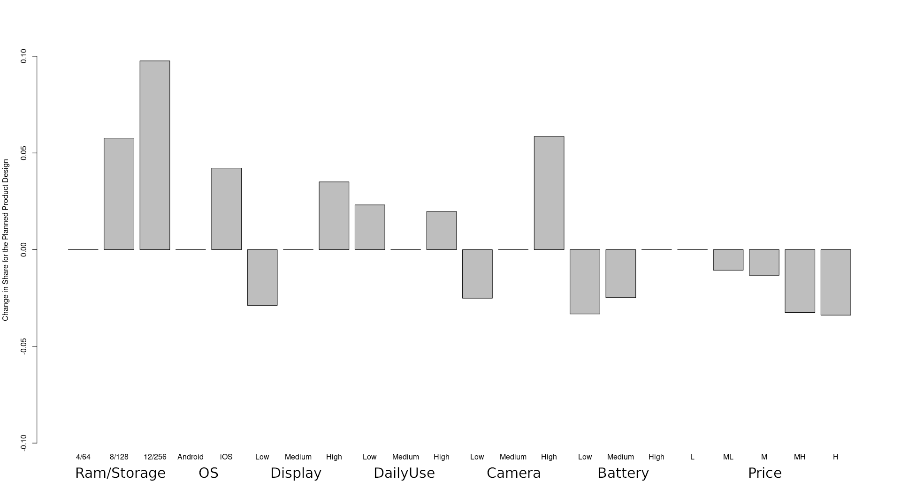

# Introduction

The aim of this study is to provide an insight on the most important features that customer take into consideration when they choose a new smartphone, in order to provide market segments and analyze customers' tastes.
The study has been conducted through the use of a choice-based conjoint analysis on data collected through an online survey thanks to the statistical tool of Multinomial Logistic Regression and Bootstrap prediction.

## Expectations and common sense

Before starting the analysis, we had some expectations based on our personal experiences as scientific students and tech enthusiasts. The first concern of an average user is about the price: how much he can afford at the moment of the purchase is, inevitably, a major limit to all the other considerations on the smartphone’s features, and consequently the quality/price ratio should always be maximized. This ratio is clearly dependent on different features, and it changes from user to user.

Users could be grouped into categories, and even if the precise identification of these categories is not the aim of this research, their experience-driven identification helped us in shaping a common sense in what we may expect from the results of the analysis. For example, a user not used to taking pictures or sharing them on social networks would be more inclined to buy a smartphone that works best on its everyday usage, while an Instagram addicted teenager would prefer the so-called “camera-phone”. Considering that the average age of the respondents should be low (university students, mostly), we were expecting slight advantages in features like daily usage and camera, given the high amount of time spent with the smartphone by young people and their propensity to use social media and share pictures and videos on them. In our opinion, operating systems shouldn’t affect the results much, especially because it’s actually difficult to have a full understanding of all the aspects related to different OS from a simple form. Moreover, the small number of devices released by Apple during the year could affect negatively on its result given its small appearance ratio over the totality of profiles. 


## Data collection

In order to collect the data needed for our analysis we designed a survey where respondents were asked to choose the smartphone profile that best suited their real-life choices. How the profiles were generated is explained further in this section. Each person answering the survey was asked to answer 13 questions and each question was composed by 3 different smartphone profiles.

Every profile is composed by several features that commonly describe such product, i.e. price, RAM and storage, quality of the display, daily usage (if the product is able to carry out daily tasks in an optimal way), quality of the camera and battery. Given the extreme heterogeneity of evaluation of such features, a known and established source was taken as ground truth for these values [2], this source provides reviews for different smartphones and a numeric summary of the features taken into account. To avoid having respondents deal with many numerical values which provide little to none meaning to the average user, the features, except price and RAM/storage, were grouped into three categories, i.e. "low", "medium" and "high" and the conversion tables are provided below. Prices were rounded to the closest hundredth, while RAM/storage was grouped into the three most common configurations for recent smartphones, "4/64 GB" for low-end devices, "8/128" for medium-end and "12/256" for high-end.

We decided to use only 2020’s smartphones, because the price may vary due to the rapid changes and evolution of the hardware. In order to have a wide range of profiles, we selected 39 smartphones of the last year. Then we put the price averaging the most popular e-commerce site and physical market. Almost all our profiles are with Android operating system, due to the poor range of Apple products with respect to the other firms. After that we converted the features using the table below.


At this point, we were able to create the final table from which we started to build the survey.
The table is shown below, and it is possible to see the original value and the transformed one.


We built the survey randomly shuffling the 39 profiles into 13 choice questions.
The survey was done by 109 respondents using Google Form, and all the results were stored in Google Sheet. Therefore, these data have been reorganized to show the chosen profile at each question. After that, we prepared the data for the future analysis, transposing the table and interpolating it with all the profiles.

At this point, we had a table with all the respondents’ choice, and all the features for each profile.


### Method used

To avoid generating every possible smartphone configuration (considering every hundredth of the price as one category it would have led to more than 5000 different profiles, most of which are unrealistic) we considered a subset of smartphone released on the market during 2020 which have the most different characteristics, similarly to the fractional factorial design principle [1], and after applying the transformations listed above we used them as our products' profiles for the survey.
The survey was presented to an heterogeneous group of people with the aim to provide a representative sample and capture the most people's behavior. It was presented to a total of N=109 people through Google Forms.

### Data preprocessing

Google Forms collects respondents' answers in a format which is not suitable for our analysis (MNL through mlogit R package), it provides only the content of the answer the user chose and therefore, in order to construct the dataset in a suitable way, we took several preprocessing steps involving several technologies.
As the first step we worked on spreadsheets to transform the content of the answer into the ID of the smartphone profile, which we have kept in a separate sheet. With this information we could easily retrieve the whole chosen profile but a problem arose, because there was no easy manner to include, for every respondent for every question, the options we had not chosen. For this task we involved the use of Python and pandas dataframes [3], which provided us with SQL-like join operator to construct respondents' profiles (the code is available in the dataTransform.ipynb Python notebook). The resulting data are in a long format which provide many benefits, first of all many advanced statistical libraries prefer this data format for computing and graphing (e.g. ggplot, lm or t.test) and secondly it provides a conceptual clarity and easiness to summary data, which cannot be achieved by wide data because every observation is a mix of a unit of analysis and and a value-holding variable. [4]
These resulting data were then imported in R and before starting the actual analysis a last step was required, converting strings to factors in order to obtain ordinal categorical variables.


# Data Analysis

```{r import, results='hide'}
library(mlogit)
library(parallel)
library(MASS)
```

### Data loading and cleaning

```{r loading}
smartphones.df <- read.csv("final.csv", sep=",")
names(smartphones.df) <- c("X", "smart.id", "quest.id", "smart.name", "profile", "price", "ram.storage", "os", "display", "dailyuse", "camera", "battery", "resp.id", "choice")
# Filter needed columns
to_keep_cols <- c("resp.id", "quest.id", "profile", "price", "ram.storage", "os", "display", "dailyuse", "camera", "battery", "choice")
smartphones.df <- smartphones.df[,to_keep_cols]
# mlogit requires every question to have a different ID
smartphones.df$quest.id <- rep(1:1417, each= 3)

# recode some variables
smartphones.df$price <- as.factor(smartphones.df$price)
smartphones.df$ram.storage <- factor(smartphones.df$ram.storage, levels = c("4/64", "8/128", "12/256"))
smartphones.df$os <- factor(smartphones.df$os)
smartphones.df$display <- factor(smartphones.df$display, levels = c("Low", "Medium", "High"))
smartphones.df$dailyuse <- factor(smartphones.df$dailyuse, levels = c("Low", "Medium", "High"))
smartphones.df$camera <- factor(smartphones.df$camera, levels = c("Low", "Medium", "High"))
smartphones.df$battery <- factor(smartphones.df$battery, levels = c("Low", "Medium", "High"))
smartphones.df$profile <- as.factor(smartphones.df$profile)
```

## Fixed MNL

```{r convert}
# convert data to the format accepted by mlogit
smartphones.mlogit <- dfidx(smartphones.df, idx = list(c("quest.id", "resp.id"), "profile"), drop.index=F,
                        levels=c("1", "2", "3"))
```

```{r fmnl, results='hide'}
# Fit the mlogit model to the data
fmnl.intercept <- mlogit(choice ~ price + ram.storage + os + display + 
               dailyuse + camera + battery, data = smartphones.mlogit)
summary(fmnl.intercept)
```

```{r fmnl_no_intercept}
# Fit the model without intercept parameters
fmnl.no.intercept <- mlogit(choice ~ price + ram.storage + os + display + 
               dailyuse + camera + battery | -1, data = smartphones.mlogit)
summary(fmnl.no.intercept)
```

```{r lrtest_1}
# Test the restriction on the intercepts by comparing the two models through a likelihood ratio test
lrtest(fmnl.no.intercept, fmnl.intercept)
```

```{r fmnl_price_quantitative, results='hide'}
# Fit the model without intercept parameters and with price as a quantitative variable
fmnl.no.intercept.quantitative <- mlogit(choice ~ as.numeric(as.character(price)) + ram.storage + os + display + dailyuse + camera + battery | -1, data = smartphones.mlogit)
summary(fmnl.no.intercept.quantitative)
```

```{r lrtest_2}
lrtest(fmnl.no.intercept.quantitative, fmnl.no.intercept)
```
Firstly, we tried to fit a mlogit model to the data: the best solution was the model without intercept parameters and with price represented as a qualitative variable. This model showed positive estimated coefficients for every medium or high feature with a great significance (\*\*\*), while, with a lower significance level, the daily use values showed a negative estimated coefficient. As expected, price has a negative estimated coefficient and its significance is high (\*\*\*). Another important aspect is that the frequency of alternative chosen by respondents is balanced (profile 1: 0.378, profile 2: 0.36, profile 3: 0.262), hence we can assume that the position of every profile hasn’t influenced the respondents’ choices.

With the last model, having price as a quantitative variable, we can compute the willingness to pay for some features

```{r willingness}
#coef(m3)["ram.storage8/128"]/(coef(m3)["as.numeric(as.character(price))"])
#coef(fmnl.no.intercept.quantitative)["ram.storage12/256"]/(coef(fmnl.no.intercept.quantitative)["as.numeric(as.character(price))"])
coef(fmnl.no.intercept.quantitative)["osiOS"]/(coef(fmnl.no.intercept.quantitative)["as.numeric(as.character(price))"])
#coef(m3)["displayMedium"]/(coef(m3)["as.numeric(as.character(price))"])
#coef(fmnl.no.intercept.quantitative)["displayHigh"]/(coef(fmnl.no.intercept.quantitative)["as.numeric(as.character(price))"])
#coef(m3)["dailyuseMedium"]/(coef(m3)["as.numeric(as.character(price))"])
#coef(fmnl.no.intercept.quantitative)["dailyuseHigh"]/(coef(fmnl.no.intercept.quantitative)["as.numeric(as.character(price))"])
#coef(m3)["cameraMedium"]/(coef(m3)["as.numeric(as.character(price))"])
coef(fmnl.no.intercept.quantitative)["cameraHigh"]/(coef(fmnl.no.intercept.quantitative)["as.numeric(as.character(price))"])
#coef(m3)["batteryMedium"]/(coef(m3)["as.numeric(as.character(price))"])
coef(fmnl.no.intercept.quantitative)["batteryHigh"]/(coef(fmnl.no.intercept.quantitative)["as.numeric(as.character(price))"])
```

The willingness to pay has also been computed: results show that an average user is willing to pay up to 215€ more to purchase a smartphone with an iOS operating system than its counterpart with an Android operating system. Camera and battery are also extremely important, since it is shown that the willingness to pay for a high level of both features is about 475€ and 620€, respectively. 

Instead of keeping this amount of levels for the price variable, we group it into the 5 categories explained at the beginning 

```{r new_data}
tmp.df <- smartphones.df
tmp.df$price <- as.numeric(as.character(tmp.df$price))
tmp.df$price <- cut(tmp.df$price, c(-Inf, 200, 300, 500, 900, Inf), c("L","ML", "M", "MH", "H"))
tmp.df$price <- factor(tmp.df$price, levels = c("L","ML", "M", "MH", "H"))

updated.smartphones.mlogit <- dfidx(tmp.df, idx = list(c("quest.id", "resp.id"), "profile"), drop.index=F,
                            levels=c("1", "2", "3"))
```

We then fit a new model without intercept on these new data

```{r fmnl.no.intercepet.ranges}
fmnl.no.intercept.ranges <- mlogit(choice ~ price + ram.storage + os + display + 
               dailyuse + camera + battery | -1, data = updated.smartphones.mlogit)
summary(fmnl.no.intercept.ranges)
```

After having added the price range and fitted the new data in a mlogit function, a more precise analysis has been performed: iOS operating system is slightly less important than in the previous model (\*\*), as well as Medium-Low and Medium price ranges and daily use features. On the other hand, Medium-High and High price ranges are still very relevant for the model (\*\*\*).

```{r generate_designs}
attributes <- list(ram.storage=names(table(updated.smartphones.mlogit$ram.storage)),
               os=names(table(updated.smartphones.mlogit$os)),
               display=names(table(updated.smartphones.mlogit$display)),
               dailyuse=names(table(updated.smartphones.mlogit$dailyuse)),
               camera=names(table(updated.smartphones.mlogit$camera)),
               battery=names(table(updated.smartphones.mlogit$battery)),
               price=names(table(updated.smartphones.mlogit$price)))
all.designs <- expand.grid(attributes) 
```

We then choose a reasonable amount of profiles for every price range and determine the preference shares separately, the "best" profiles for every category are then compared

```{r preference_by_price}
all.designs.low <- all.designs[all.designs$price=="L" & all.designs$os=="Android" & all.designs$ram.storage=="4/64",]
row.names(all.designs.low) <- NULL
new.data.low <- all.designs.low[c(67, 55, 68, 59, 32, 40, 31, 38, 41, 14, 23),]

all.designs.mlow <- all.designs[all.designs$price=="ML" & all.designs$os=="Android" & all.designs$ram.storage!="12/256",]
row.names(all.designs.mlow) <- NULL
new.data.medium.low <- all.designs.mlow[c(143, 136, 119, 144, 132, 120, 88, 47, 48, 134, 83, 122, 11, 94),]

all.designs.medium <- all.designs[all.designs$price=="M" & all.designs$os=="Android" & all.designs$ram.storage=="8/128",]
row.names(all.designs.medium) <- NULL
new.data.medium <- all.designs.medium[c(45, 69, 44, 68, 36, 60, 17, 18, 72),]

all.designs.mhigh <- all.designs[all.designs$price=="MH",]
row.names(all.designs.mhigh) <- NULL
new.data.medium.high <- all.designs.mhigh[c(319, 322, 242, 245, 302, 305, 249, 252, 320, 476, 297, 321, 429, 411),]

all.designs.high <- all.designs[all.designs$price=="H" & all.designs$ram.storage!="4/64",]
row.names(all.designs.high) <- NULL
new.data.high <- all.designs.high[c(202, 204, 213, 215, 94, 96, 178, 165, 18, 95, 20, 92, 90, 173, 175),]
```

```{r pred_def, echo=FALSE}
predict.mnl <- function(model, data) {
  data.model <- model.matrix(update(model$formula, 0 ~ .), data = data)[,-1]
  logitUtility <- data.model%*%model$coef
  share <- exp(logitUtility)/sum(exp(logitUtility))
  cbind(share, data)
}
```

```{r pred_boot, echo=FALSE}
BootCI.predict.mnl <- function(model, data, nsim=500, conflevel=0.95) {
  dataModel <- model$model
  dataModel$probabilities <- NULL
  dataModel$linpred <- NULL
  idx <- dataModel$idx 
  dataModel$idx <- NULL
  dataModel <- data.frame(dataModel, idx)
  idVar <- unique(dataModel[,names(idx)[1]])
  
  bootstrapping <- function(x) {
    idbootsamp <- data.frame(sample(idVar, replace=T))
    names(idbootsamp) <- names(idx)[1]
    bootsamp <- merge(idbootsamp, dataModel, by=names(idx)[1], all.x=T)
    bootsamp[,names(idx)[1]] <- rep(1:length(table(idx[,1])), each=length(table(idx[,3])))
    bootsamp.mlogit  <- dfidx(bootsamp, idx = list(c(names(idx)[1:2]), names(idx)[3]),
                              drop.index=F)    
    bootfit <- update(model, data = bootsamp.mlogit)
    data.model <- model.matrix(update(bootfit$formula, 0 ~ .), data = data)[,-1]
    logitUtility <- data.model%*%bootfit$coef
    share <- exp(logitUtility)/sum(exp(logitUtility))
    share
  }
  
  cl <- makeCluster(detectCores())
  clusterEvalQ(cl, library(mlogit))
  clusterExport(cl, varlist=c("idVar", "dataModel", "idx", "model", "data"), 
                envir=environment())
  bootdistr <- parLapply(cl, 1:nsim, fun=bootstrapping)
  stopCluster(cl)
  
  bootdistr <- do.call(cbind, bootdistr)
  lowl <- (1-conflevel)/2
  upl <- 1-lowl  
  bootperc <- t(apply(bootdistr, 1, function(x) quantile(x, probs=c(lowl, upl))))
  pointpred <- predict.mnl(model, data)
  predictedShares <- cbind(pointpred[,1], bootperc, pointpred[,2:ncol(pointpred)])
  names(predictedShares)[1] <- "share" 
  predictedShares
}
```


```{r pref, echo=FALSE, results="hide"}
# We then pass these designs to predict.mnl() to determine what customers
# would choose if they had to pick among these smartphones alternatives:
predict.mnl(fmnl.no.intercept.ranges, new.data.low) 
predict.mnl(fmnl.no.intercept.ranges, new.data.medium.low)
predict.mnl(fmnl.no.intercept.ranges, new.data.medium) 
predict.mnl(fmnl.no.intercept.ranges, new.data.medium.high) 
predict.mnl(fmnl.no.intercept.ranges, new.data.high) 
```

The best for each category are then taken into account for the last preference share prediction

```{r best_pref}
new.data <- all.designs[c(403, 223, 878, 914, 1400, 1382, 1887, 1779, 1763, 2267, 2250, 2264),]
predict.mnl(fmnl.no.intercept.ranges, new.data)
```

To have more statistical-relevant results let's calculate confidence intervals for the shares

```{r best_pref_boot}
BootCI.predict.mnl(fmnl.no.intercept.ranges, new.data)
```

By predicting the mnl for this last model, we can find a preference for smartphone with Medium-Low or Medium price range, with an Android operating system and 8/128GB RAM/Storage values, a high level of battery and display, a medium level of camera features and variable level of daily use parameters.

```{r sensitivity, echo=FALSE}
sensitivity.mnl <- function(model, attrib, base.data, competitor.data) {
  # Function for creating data for a preference share-sensitivity chart
  # model: mlogit object returned by mlogit() function
  # attrib: list of vectors with attribute levels to be used in sensitivity
  # base.data: data frame containing baseline design of target product
  # competitor.data: data frame containing design of competitive set
  data <- rbind(base.data, competitor.data)
  base.share <- predict.mnl(model, data)[1,1]
  share <- NULL
  for (a in seq_along(attrib)) {
    for (i in attrib[[a]]) {
      data[1,] <- base.data
      data[1,a] <- i
      share <- c(share, predict.mnl(model, data)[1,1])
    }
  }
  data.frame(level=unlist(attrib), share=share, increase=share-base.share)
}
```

### Calculate and plot sensitivity

```{r plot_sensitivity, results='hide', eval=FALSE}
base.data <- new.data[1,]
competitor.data <- new.data[-1,]
(tradeoff <- sensitivity.mnl(fmnl.no.intercept.ranges, attributes, base.data, competitor.data))

barplot(tradeoff$increase, horiz=FALSE, names.arg=tradeoff$level,
        ylab="Change in Share for the Planned Product Design", 
        ylim=c(-0.1,0.11))
grid(nx=NA, ny=NULL)
```



The predicted share sensitivity shows an important decrease when the price rises (-0.034 from Low to High range) or when the battery parameter decreases (-0.033 from High to Low). A great camera is important (0.05 from Medium to High), as well as an iOS operating system (0.042 more than Android), a good display (0.035 from Medium to High) and a great ram/storage (0.097 from 4/64 to 12/256).


## Control for customers' heterogeneity 

Let's fit a MMNL model in order to check for customers' heterogeneity

```{r rpar}
model.random.parameters <- rep("n", length=length(fmnl.no.intercept.ranges$coef))
names(model.random.parameters) <- names(fmnl.no.intercept.ranges$coef)
```

```{r mmnl_fit}
m.mixed <- mlogit(choice ~ price + ram.storage + os + display + 
                     dailyuse + camera + battery | -1, data = updated.smartphones.mlogit,
                  panel=TRUE, rpar = model.random.parameters, correlation = FALSE)
summary(m.mixed)
```

```{r plot_mixed}
plot(m.mixed)
```

The mixed mnl model mostly confirmed the previous results, but it stressed the importance of the iOS operating system (\*\*\*).

From this plot we can understand that most of the people are interested into iOS as operating system and that therefore it should be taken into consideration when making managerial choices.

On the other hand, the only other variable that shows heterogeneity is the high daily usage but in every model we tested it has no statistical importance to determine the choice.


We can add correlation among variables to the model

```{r mixed_correlation, results='hide'}
m.mixed.cor <- update(m.mixed, correlation = TRUE)
summary(m.mixed.cor)

cov2cor(cov.mlogit(m.mixed.cor))

summary(vcov(m.mixed.cor, what = "rpar", type = "cor"))
```

And then restrict to have correlation only among few of them

```{r mixed_correlation_reduced}
m.mixed.cor.reduced <- update(m.mixed.cor, correlation = c("ram.storage12/256", "osiOS",
                                             "displayHigh", "batteryMedium", "batteryHigh", "cameraHigh"))
```

With the likelihood ration test we can compare these models

```{r mixed_lr_test}
lrtest(fmnl.no.intercept.ranges, m.mixed) #Fixed effects vs. uncorrelated random effects
lrtest(m.mixed, m.mixed.cor) #Uncorrelated random effects vs. all correlated random effects
lrtest(m.mixed.cor.reduced, m.mixed.cor) #partially correlated random effects vs. all correlated random effects
```

We can now compute preference share in the MMNL model

```{r pred_mmnl, echo=FALSE}
predict.mixed.mnl <- function(model, data, nresp=1000) {
  # Function for predicting shares from a mixed MNL model 
  # model: mlogit object returned by mlogit()
  # data: a data frame containing the set of designs for which you want to 
  #       predict shares. Same format at the data used to estimate model. 
  # Note that this code assumes all model parameters are random
  data.model <- model.matrix(update(model$formula, 0 ~ .), data = data)[,-1]
  coef.Sigma <- cov.mlogit(model)
  coef.mu <- model$coef[1:dim(coef.Sigma)[1]]
  draws <- mvrnorm(n=nresp, coef.mu, coef.Sigma)
  shares <- matrix(NA, nrow=nresp, ncol=nrow(data))
  for (i in 1:nresp) {
    utility <- data.model%*%draws[i,]
    share = exp(utility)/sum(exp(utility))
    shares[i,] <- share
  }
  cbind(colMeans(shares), data)
}
```

```{r boot_mmnl_def, echo=FALSE}
BootCI.predict.mixed.mnl <- function(model, data, nsim=500, conflevel=0.95, nresp=1000) {
  dataModel <- model$model
  dataModel$probabilities <- NULL
  dataModel$linpred <- NULL
  idx <- dataModel$idx 
  dataModel$idx <- NULL
  dataModel <- data.frame(dataModel, idx)
  idVar <- unique(dataModel[,names(idx)[1]])
  
  bootstrapping <- function(x) {
    idbootsamp <- data.frame(sample(idVar, replace=T))
    names(idbootsamp) <- names(idx)[1]
    bootsamp <- merge(idbootsamp, dataModel, by=names(idx)[1], all.x=T)
    bootsamp[,names(idx)[1]] <- rep(1:length(table(idx[,1])), each=length(table(idx[,3])))
    bootsamp.mlogit  <- dfidx(bootsamp, idx = list(c(names(idx)[1:2]), names(idx)[3]),
                              drop.index=F)    
    bootfit <- update(model, data = bootsamp.mlogit)
    data.model <- model.matrix(update(bootfit$formula, 0 ~ .), data = data)[,-1]
    coef.Sigma <- cov.mlogit(bootfit)
    coef.mu <- bootfit$coef[1:dim(coef.Sigma)[1]]
    draws <- mvrnorm(n=nresp, coef.mu, coef.Sigma)
    shares <- matrix(NA, nrow=nresp, ncol=nrow(data))
    for (i in 1:nresp) {
      utility <- data.model%*%draws[i,]
      share <- exp(utility)/sum(exp(utility))
      shares[i,] <- share
    }
    colMeans(shares)
  }
  
  cl <- makeCluster(detectCores())
  clusterEvalQ(cl, {
    library(mlogit)
    library(MASS) })
  clusterExport(cl, varlist=c("idVar", "dataModel", "idx", "model", "data", "nresp", 
                              paste(model$call$rpar)), envir=environment())
  bootdistr <- parLapply(cl, 1:nsim, fun=bootstrapping)
  stopCluster(cl)
  
  bootdistr <- do.call(cbind, bootdistr)
  lowl <- (1-conflevel)/2
  upl <- 1-lowl  
  bootperc <- t(apply(bootdistr, 1, function(x) quantile(x, probs=c(lowl, upl))))
  pointpred <- predict.mixed.mnl(model, data, nresp)
  predictedShares <- cbind(pointpred[,1], bootperc, pointpred[,2:ncol(pointpred)])
  names(predictedShares)[1] <- "share" 
  predictedShares
}
```

```{r predict_mmnl}
predict.mixed.mnl(m.mixed.cor, data=new.data)
```

And compute confidence intervals

```{r boot_mmnl}
BootCI.predict.mixed.mnl(m.mixed.cor, data=new.data, nresp = 3, nsim = 3)
```
The last prediction made with a mixed mnl had to be customized: in order to perform the analysis and computing the confidence intervals, the function parameters were set to 5 respondents and 10 simulations because with default values the program would lasts for hours given the dimension of the dataset and the variance/covariance matrix. 

Obviously, confidence intervals ended up to be pretty big, but the preference shares were realistic: the preferred smartphone was defined as an Android based smartphone with a Medium-Low price range, 8GB of RAM and 128 of storage, with a medium camera level and high levels of battery, display and daily use. This profile, among all the others, would retain a 35% user’s preference share.

# Conclusions

Results showed and confirmed some of our prior beliefs, in particular we understood that the most prominent price sector is the medium to medium-low, where most of the preference is located.

But a non-negligible portion of users are located in the medium-high and high sector and in this context smartphones with iOS as operating system result as winners of customers' preferences.

From the willingness-to-pay we got that people are going to pay up to 200 more euros in order to buy a smartphone equipped with iOS as operating system. Given that the OS is the only "non-physical" property that we included in the survey we think some considerations should be made.

We know that from a technological point of view the advantages of iOS is the optimization made between software and hardware and the easiness to use that some part of users seek. So the reasons behind these choice has not to be thought as a "hard" choice but more of a "soft" one, where the brand makes a great difference.

## Managerial advices

From a managerial point of view our results suggest that the range where investments should be made is the medium to medium-low, and particular attention should be put into the quality/price ratio, with an eye on a good amount of RAM and storage, and good display and battery.

On the other hand, if one wants to enter the high-end market he/she has to consider the predominant share that iOS has in that range. 

### References

[1] Taherdoost, Hamed. (2016). Sampling Methods in Research Methodology; How to Choose a Sampling Technique for Research. International Journal of Academic Research in Management. 5. 18-27. 10.2139/ssrn.3205035. 

[2] Galeazzi Andrea, https://andreagaleazzi.com/

[3] pandas - Python Data Analysis Library, https://pandas.pydata.org

[4] Tidy data, Hadley Wickham; *The Journal of Statistical Software*, vol. 59, 2014.